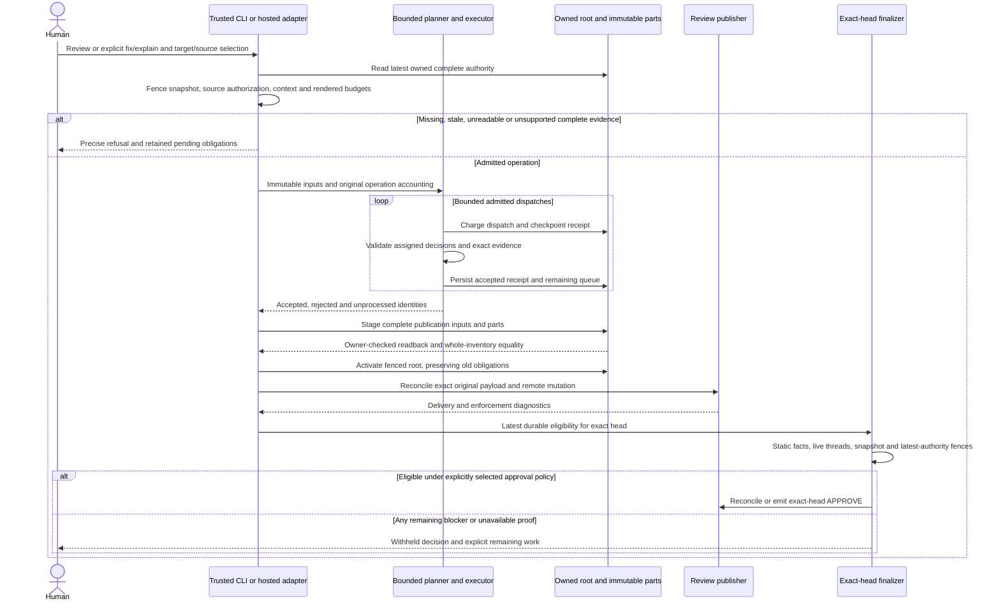

# Independent Epic238 architecture review

Status: Proposed review recommendations, not an accepted runtime contract.
Date: 2026-10-10 UTC. Decision owner: maintainer and Epic238 integration coordinator.
Disposition refresh: 2026-10-10 UTC, against the immutable pending heads below.
Related issues: [#238](https://github.com/malsabbagh/review-sensei/issues/238)
and existing #239–246. Implementation remains with their six lanes; this review
changes no runtime code, interfaces, ownership, release, or deployment.

## Decision and readiness

Keep the documented provider-neutral pipeline and existing storage adapters:
**review → complete findings → fix or explain → reassess → explicit decision**.
Use one reviewed authenticated partition/reader contract and bounded durable
operation receipts. Do not introduce another evidence service, competing queue,
or an approval shortcut. Freeze integration only after the contract decisions
below have an owner and an executable combined acceptance case.

**Current decision: retain the complete-evidence qualification and activation
hold.** Pending PR257 supplies many previously proposed mechanisms; PR265 adds
complete-response and endpoint guards. Neither delivers the authenticated public
original-attempt/bootstrap/restore path or a useful measured whole-budget
lifecycle. Mandatory PR231 guidance still exceeds the unqualified prompt bound.
The following disposition matrix supersedes implementation-status descriptions
in the historical audit; historical observations remain evidence about their
explicit original SHA, not failures asserted against these pending heads.

**Historical baseline verdict, preserved:** Not ready to close Epic238 or qualify
the complete-evidence release. At the original audited main, current
source implements valuable fail-closed behavior and the cross-file packing fix,
but does not supply the complete advertised lifecycle. Shared context can prevent
all discovery, default full-publication recovery can lose its required input,
and the epic contradicts the existing missing-check approval policy. Partition,
feedback, queue, source, publication, and finalizer seams need combined tests.
Passing source tests is evidence about that source, not about installed or
published wheel/native/npm bytes or the deployed action v5.

This decision record recommends completing those seams rather than repeatedly
redesigning the engine. Maintainer approval belongs in the coordinator's canonical
ADR; this document neither registers another numbered ADR nor marks ADR 0072
Accepted. Its implementation is merged while its recorded status remains Proposed.

## Current pending integration and finding dispositions

This refresh inspects [PR257][pending-integration] at
`6338e57c485132632cff3090a651eeb7f8cdda18` and its stacked
[PR265][pending-provider-guards] at
`a9cdcd49c64bd4ad21eafa9f4585823562c8e76a`. PR265's runtime/test files are
byte-identical to independently reviewed `c1ec28676ffb8f85a73d84ec8d1807266a31efe2`;
its final commit only links Proposed ADR0075 to the draft. PR253 was synchronized
to main `1acd1f20efa0c27b49090041b0232d5d57ef86b4` before this docs-only refresh.
That synchronization did not incorporate pending runtime changes into main or
make the old assessment a review of them.

The inspected integration source, [current status][integration-status],
[live Epic ledger][live-epic] and the bounded independent handoffs underpin the
dispositions below. **Implemented pending** means inspected code and scoped
tests in an unmerged draft. **Partial** means a mechanism is implemented but the
original user journey or whole resource/authority proof remains open. None means
enabled, deployed, universally supported or approved for release. All partition
and indexed-history writers and v4 finalization remain disabled; the default
public mention still uses the legacy 4 KiB source route. No row closes an issue.

| Original finding | Disposition at the pinned pending source | Remaining acceptance or authority gate |
| --- | --- | --- |
| R1 shared rendered context | **Partial fix.** PR257 serializes each shared document once, preserves mandatory guidance and carries optional-selection digests/omissions into partial results. [Context tests][integration-context-tests] cover admission and coverage. | The complete PR231 mandatory architecture document is 61,136 UTF-8 bytes before framing versus 49,152 unqualified prompt bytes. Deduplication/optional selection does not solve that mandatory bound. Reviewed trusted-policy correction, qualification of a finite provider capability, or a separate complete-guidance design and meaningful actual review remain required. |
| R2 missing-check policy | **Unchanged product-policy disposition pending.** Existing documented diagnostic-only check publication behavior is preserved in PR257/265. | Reconcile the epic's unconditional missing-check negative with the existing policy explicitly. This report does not choose a new approval gate or assert branch-protection satisfaction. |
| R3 lost-runner full-publication input | **Public gap remains.** Complete authenticated baseline readers and receipt-first private diagnostic recovery are implemented; they do not reconstruct all original full-publication payload/admission inputs on the default lost-runner route. [Integration status][integration-status] separates those authorities. | Prove the public artifacts-none full-review restart with exact original payload/context and reconciled publication. Optional diagnostics and a stored digest are not the missing payload. |
| R4 root/latest-authority scan pressure | **Partial fix.** Authenticated bounded part readers, adaptive acquisition and current-root/direct-child association are implemented. [History association][integration-history-proof] authenticates the complete direct-child inventory and exact selected reference. | Joint root/history/eligibility scans, every retained child and bootstrap must fit the original budget. Sparse child lookup and successful codec reads alone do not qualify discovery/activation of the whole graph. |
| R5 deadline/read-budget composition | **Partial fix.** Live operations prepay bounded activation tails; absolute original accounting is retained. Structural fixtures use an explicit acquisition clock and retain an exact-60-second refusal negative. | No useful public original 64-dispatch/60-second journey is qualified. Include provider elapsed time, source/head/root fences, broker-internal calls, retries, finalization and acknowledgement without resets or invented restored proof. |
| R6 targeting/fairness/complete feedback | **Implemented pending primitives; public wiring incomplete.** Complete instance identities, explicit targets, fair queues and authenticated ordered full-feedback helpers exist in PR257. [Queue tests][integration-queue-tests] and [feedback tests][integration-feedback-tests] exercise their seams. | Expose and qualify the actual public selection/continuation/factory workflow, fresh source/role fences and original allowance. The legacy public mention is still 4 KiB; prose naming does not confer target authority. |
| R7 atomic evidence and scope handoff | **Partial fix.** Exhaustive materialization, complete feedback preflight, factored history and explicit coalesced admission/dispatch are implemented behind their reviewed seams. | Complete supported joint evidence must reach a validated decision through the public workflow; unsupported groups remain pending. No independently accepted fragments, model summary or undocumented disabled expansion supplies aggregate resolution authority. |
| R8 unchanged source and route contexts | **Precise supported refusal; context fixes partial.** Exact changed-file acquisition/path handling is implemented; missing unchanged-path evidence remains a safe refusal. Shared/optional context coverage is explicit. | Qualify normal, broader, custom-lens and hosted invocation semantics. Do not infer a new exact unchanged-source lookup/citation authority from exhaustive changed-file acquisition. |
| R9 ack/replay and lost response accounting | **Partial fix.** Durable checkpoint/diagnostic receipts, pre-dispatch output reservation and actual process-fault fixtures cover original charges, accepted decisions and unknown outcomes. [Recovery tests][integration-recovery-tests] retain their scope. | Public source acknowledgement before refreshed COMMENT remains an open restart boundary. Accepted authority must be durable/read back before ack, with no repeated inference or duplicate committed mutation. Private cache reuse and synthetic checkpoint kills are not that public proof. |
| R10 artifact/readers/rollout | **Source and installed-candidate evidence delivered; activation qualification remains.** Exact PR257/265 CI and candidate installed-package evidence are separate from the historical 2,714-test record below. | Final combined public lifecycle, compatible active/delayed readers, reader-first drain and separately authorized published/deployed rich-feature observations remain required. Published merged-main 0.6.19/v5 excludes these pending features. |
| R11 original grant/generation/tail composition | **Live tail defect corrected; durable authority partial.** PR257 prepays same-live-ledger tails, validates evolving root/grant references and includes a dormant sticky SQLite original-attempt journal. [ADR0074][integration-attempt-adr] is Proposed; clock/callback-key corrections are independently verified. | The journal has no production construction, public authorizer/endpoint or restore authority. Trusted first-admission derivation, server-origin/bootstrap liability, same-storage consumption and exact current owned-root proof remain required. New grants/root references cannot manufacture an original witness. |
| R12 cumulative retention capacity | **Structural progress demonstrated; whole lifecycle unqualified.** Indexed/coalesced synthetic 250 history retains 64 sources and all original receipts in 129 pieces / 3,029,999 framed bytes. Bounds remain 32 active operations, 256 retained sources, 2 MiB current decoded documents, 256 pieces / 8 MiB physical retention. | Combine baseline/inventory/prose/feedback/evidence/current queue/tombstones and all child validation with root/scan/control budgets. Structural timing or queue-only bytes do not prove hosted 250 throughput; no eviction/reset may erase obligations or renew an event's allowance. |

PR265 additionally closes the independently reproduced **provider guard gaps**
under I1/I11: unsafe present completion/termination/usage metadata is refused even
when review JSON parses; strict library construction requires complete metadata,
exact model and a finite cap. Qualified capabilities bind exact endpoint and
`bounded-complete-text-v1`. Dispatch rechecks after the durable callback, wrappers
read current identity, and malformed current caps refuse before transport.
Independent original probes now make zero transport calls: a callback conflict
retains one charged call, the unknown output reservation and accounting checkpoint.
The bounded independent selection passed 80 tests. [Guard implementation/tests][provider-guard-tests]
and [Proposed ADR0075][provider-guard-adr] delimit the contract. Legacy absent
metadata remains accepted in its unqualified mode; no CLI/factory adopts strict
mode or a larger capability. Hosted tokenizer/template mapping and installed
producer authority are separate unresolved qualifications, not facts inferred
from this adapter declaration. The finite capability candidate remains false.

### Pending component head index and inspection limits

These are the verified remote component heads at this refresh. The reviewed
composition is PR257's selected source, plus PR265's guard delta; this index does
**not** assert a fresh independent full-suite review of every standalone branch.
Some selected commits were cherry-picked or followed by owned amendments, so an
open component head is not automatically the integration's ancestor or exact tree.
The older PR250 `ba89418` and A `0ca0f8e` measurements below remain historical.

| Pending PR / responsibility | Verified immutable component head |
| --- | --- |
| [248](https://github.com/malsabbagh/review-sensei/pull/248), F packing/process faults | `09b4256ede082bc9a87c65c547c65f4f466eb90b` |
| [249](https://github.com/malsabbagh/review-sensei/pull/249), D authenticated feedback | `3749b14d5df9b017785e5ea9a18e38db5020ca51` |
| [250](https://github.com/malsabbagh/review-sensei/pull/250), A complete baseline/parts | `f364de1d67a13e86879385a13b10684caec312bb` |
| [251](https://github.com/malsabbagh/review-sensei/pull/251), B identity/inventory | `647a2db3a17e0e01e7c3017e5cecde9cc7a1ec10` |
| [252](https://github.com/malsabbagh/review-sensei/pull/252), E exact evidence/context | `b24461ab86a380e4165cb13cf6a5807636d302fa` |
| [254](https://github.com/malsabbagh/review-sensei/pull/254), B feedback/prose staging | `955e95140478b28d7341551579c67d64a04afccb` |
| [255](https://github.com/malsabbagh/review-sensei/pull/255), C durable queue | `09b7c86f85f55c9a7a99e411f2a4905b776c4ccb` |
| [256](https://github.com/malsabbagh/review-sensei/pull/256), C feedback/coalescing | `c54ea6e170629d2f6b792b90105a26afa0e7ac7a` |
| [258](https://github.com/malsabbagh/review-sensei/pull/258), D source integration helpers | `724407696a70f1d28ee05016e87d32b930a1f27f` |
| [259](https://github.com/malsabbagh/review-sensei/pull/259), C factored history/host seam | `d60e4b88c97c13a837813070e07f41a49ee3023c` |
| [260](https://github.com/malsabbagh/review-sensei/pull/260), A tails/direct-child ownership | `325e2d1920991130647d4bc40559f884dbe7b314` |
| [261](https://github.com/malsabbagh/review-sensei/pull/261), C indexed receipts | `c425739851989bda81649eefe2d917dd70b522fc` |
| [262](https://github.com/malsabbagh/review-sensei/pull/262), C combined admission/dispatch | `1de80b17771ac71f44b17640dfa2fb86d4daf73d` |
| [263](https://github.com/malsabbagh/review-sensei/pull/263), C restore-before-render | `752ac2651240afd2d5d40a66af45866288d9308b` |
| [264](https://github.com/malsabbagh/review-sensei/pull/264), C structural acquisition clock | `5f027d8d37c423194c1a6e86a1b7eba2fdbd59ee` |

### Exact-source evidence and next decision

GitHub independently reports both pinned CI runs completed successfully, with all
15 actual jobs including Required checks: [PR257 CI 38022774364][integration-ci]
and [PR265 CI 38027024046][provider-guard-ci]. Auxiliary ReviewSensei trigger
success is a separate observation. PR257's owner records 3,023 tests / 83.52%
coverage, exact exported wheel/sdist and outside-checkout installed 21 distribution-safe,
11 downstream and 28 graph/recovery tests. PR265 records 3,043 tests / 83.57%,
exact build/installed 21 distribution-safe, 11 downstream and 20 guard regressions.
Those retained owner records and independently checked CI must not be relabeled
this docs branch's test counts or public deployment evidence.

The next architecture decision remains **trusted first-admission derivation**:
workflow/run/tag OIDC establishes the approved caller, but does not independently
derive rendered prompt semantics or identify installed Python dependency bytes.
An explicit producer-delegation decision and independently validated complete
root/source/inventory/budget/liability document, or a reviewed shared derivation
mechanism, must precede public original-attempt authority. This refresh chooses
neither option. No parallel authorizer, queue or storage service is introduced.

Before Epic done, require combined full review → findings → fix/explain →
reassessment → exact-head decision through the actual public route, including
crash/concurrency/refusal branches under the original complete physical budget.
Then qualify exact installed/published artifacts and active/delayed consumers in
the authorized reader-first sequence. Current positive source/primitive evidence
and honest pending outcomes are useful progress, not complete lifecycle support.
The existing proposed sequence diagram below remains a target contract; its
staging/activation/publication arrows are not a diagram of enabled PR257 behavior.

## Historical inputs and evidence status

Original inspected main is `e8fdcd18f8256b1ceaab323701a2570b208d4e75`, including
PR231. The runtime audit and synthetic probes pin its unchanged runtime ancestor
`70305207647c22595660e5ebb9e4a33991489ffe`; local ancestry checks include merged
PRs #235/#236/#237/#247. PR231 changes the release workflow/helper/tests/docs,
not `src/review_sensei` or the review workflow. The fresh diff was inspected and
the complete local gates rerun on latest main. PR235's diagrams pin historical
`a598d4ae47892d243ce67333bcc5c182da95637a`; its separate PR236 proposal pins
`9fb5ad6bf74c8cd169b730df4bd5232f59ef2d7d`. Historical diagrams are preserved,
not silently relabeled current. Runtime code links below pin the unchanged
`7030520` source; release/prototype links identify their separate immutable SHA.

“Implemented” below means inspected source at that SHA. “Proposed” means an
issue/interface recommendation. “Contradicted” means source/tests disagree with
the stated claim. “Unverified” means the requisite observation was not retained.
None means “shipped” by implication. The main workflow reads a version from its
workflow commit and installs that exact PyPI version first; only an unavailable
distribution allows exact-workflow-commit fallback. A development checkout with
the same version string does not prove its bytes are in PyPI, npm, or action v5.
([workflow][workflow], [rollout](review-runtime-rollout.md))

Emerging design was reviewed before interface lock: A's proposal **v1.1** at
`docs/proposals/issue-240-authenticated-partitions.md` in its isolated lane,
SHA256 `b090f9379a3032449ce51a7ae33335c4c9f9d326f58c1c051d15438e768bc937`.
It specifies 32 KiB framed parts, 32 codec parts, 1 MiB framed / 2 MiB decoded,
8 KiB manifest, 256 retained parts / 8 MiB, one 64-dispatch / 60-second absolute
budget with four final fences, and existing adapter ownership. These are proposed
codec envelopes, **not measured end-to-end capacity**. Actual root allocation,
enumeration, staging/readback, receipts and finalization can admit less.
The coordinator confirms that timing, persistence, concurrency, and retention
are not frozen. B's proposed instance identity hashes exact path/line/side/body,
with a separate lifecycle hash and metadata-bound inventory digest; C/D supply
trusted explicit target/source APIs. Their integrated behavior is unverified.

A's codec prototype was subsequently frozen at
`ba89418d21898d14e6d1e535a5409c47c7cff3b2` in draft PR250. Its queue/root-slot
amendment remains separate. C's inspected working journal raised retained
operations from eight to **32**; this addresses the minimum-run count, but is not
a measured 250-finding lifecycle guarantee under the 2 MiB receipt aggregate.
Neither prototype is merged by this review.

## Historical claim-to-code-and-test matrix

This table retains the original pinned-main observations. Consult the current
dispositions above for pending fixes; “current” within these original rows refers
to the original `7030520`/`e8fdcd1` audit, not PR257 or PR265.

| Claim or handoff | Current source evidence and test oracle | Status / consequence |
| --- | --- | --- |
| Bare library review produces an outcome, not a GitHub transaction | [ReviewService][service]; `test_review_work`, `test_stages` | Implemented. Host owns authorization, ledger and publication. |
| Normal CLI supplies trusted lens selection, learnings and context | [CLI context construction][cli-context], [selector][context]; `test_context`, `test_context_capacity` | Implemented. Required documents and optional excerpts are different obligations. |
| All configured/custom lenses execute identically on every route | [normal CLI][cli], [broader service construction][cli-broader], [bare broader request][reassessment-broader] | Contradicted if asserted. Targeted assessment has no lens stages; broader discovery lacks normal lens documents/learnings/applicability. Hosted full review does not pass custom stage-directory flags. Historical guide discloses this. |
| Splitting files/hunks makes any legally selected context reviewable | [discovery render][discovery-render], [formatter][formatter], [planner admission][packing]; synthetic shared-context probe | Contradicted. A legal 50,000 B document plus a 93 B diff gives zero calls and partial coverage. Shared context is repeated in each batch. |
| Category agreement proves a defect | [stage aggregation][service], [candidate verifier][verifier] | Unsupported. Deduplication and schema validation are not independent semantic proof. Confirmed verification requires exact supplied evidence; default analysis is legacy evidence policy. |
| Current main still writes only two baseline findings / counts duplicate paths before deduplication | [baseline writer][baseline], [path admission][baseline-paths]; capacity and duplicate-path probes | Contradicted as a current claim; correct historical snapshot. Inline complete metadata supports larger inventories within finite byte/lifecycle bounds. |
| A legal 250-comment ReviewResult necessarily persists and publishes | [validation][validation], [baseline][baseline], [human inventory][human], [publication][publication]; varied capacity probe | Contradicted. Count ceilings, immutable inventory, resolution growth and framed review bytes are separate. Varied 100/250 profiles refuse. |
| One finding needing five/eight small complete patches is rejected for reference count | [packing][packing]; `test_review_work` and 1/4/5/8-path probe | Fixed in current main; each group gets one call/decision. Genuine rendered-prompt/diff overflow still refuses. #239 needs final selected-source qualification, not another implementation. |
| Naming a late finding in ordinary prose targets it | [requirements][reassessment], [sorted capped planner][planning]; 50-finding late-target probe | Contradicted. Eight calls give 32 decisions; an empty-decision reply repeats the same first 32. C's trusted target/queue API is Proposed. |
| Existing default hosted runs durably resume every accepted batch | [executor][execution], [optional recovery][recovery], [reply orchestration][application] | Unverified/absent as a default product claim. Current private diagnostic recovery is opt-in. C's authenticated checkpoint is Proposed. |
| A baseline and result digest reconstruct full pending publication | [pending CLI branch][cli-recovery], [transaction tests][transaction-tests], [architecture](architecture.md) | Contradicted. Retry requires original validated result and trusted admission contexts; default lost-runner recovery needs an owner. |
| Conversation history is complete human evidence | [bounded conversation][conversation], [source reload][human-host] | Contradicted. Chat selects 20 messages and clips each to 1 KiB. Separate admitted human source is complete only up to 4 KiB. |
| Long selected sources always fit a provider request | [4 KiB source admission][human], [48 KiB effective prompt][budgets], [render][reassessment] | Proposed, not implemented. A 64 KiB source or 256 KiB aggregate cannot be inserted whole into a 48 KiB prompt. D's full prompt preflight is required. |
| A current-head explanation can assess unchanged source | [changed-file acquisition][acquisition], [required path lookup][reassessment], [citation validation][human] | Absent for unchanged paths. Missing exact path patch gives zero calls/pending. #244 must decide a trusted complete source-evidence seam or document precise supported refusal. Historical inline fragments cannot supply it. |
| Broader review may retire old findings by omission | [eligibility union][approval-union], `test_work_continuation` | Contradicted; old obligations and stricter groups remain. New result is separate publication authority. |
| Large atomic groups can resolve from independent fragment decisions | [atomic planner][packing], [by-path evidence][evidence] | Unsupported. Discovery hunk partitioning differs from complete reassessment groups. E proposes exhaustive materialization and safe refusal, not multipiece aggregate-resolution authority. |
| Adaptive evidence pagination is exhaustive at every resource limit | [HTTP pagination][http], [snapshot fences][acquisition]; `test_github_http`, 999/1000/1001 probe | Conditional. Same-offset shrink exists. Exact 1,000 full-page items still refuse without EOF proof at current main; E proposes a count-bound EOF probe. |
| A complete part codec makes latest authority discoverable | [fixed-page root discovery][ledger], [fixed-page review reader][eligibility-reader]; 20 × 32 KiB history probe | Contradicted as a general claim. Current fixed-100 scan exceeds 512 KiB. A proposes bounded five-item metadata scans; all review/eligibility readers and repeated-operation pressure remain qualification work. |
| Digests authenticate parts or source authors | [ledger ownership][ledger], [source authorization][human-host], A v1.1 | Contradicted. Adapter-observed producer/association authenticates; hash/length detects alteration. No part-selected arbitrary URL/path or credential is allowed. |
| GitHub generation checks are atomic CAS / workflow concurrency is FIFO | [ledger race boundary][ledger], [workflow groups][workflow], historical guide | Contradicted. GitHub PATCH remains non-atomic; local independent processes require serialization; a queued GitHub job can be replaced. |
| Retry/cancel/restart grants fresh resources automatically | [executor][execution], [tracker][outcomes], `test_work_recovery`, `test_review_transaction` | Contradicted. Dispatches/retries are charged and recovery retains expiry. Proposed default receipts must preserve this across process boundaries. |
| Remaining human concern, required fix, incomplete coverage or stale latest authority can approve | [facts][approval-facts], [finalizer][finalizer], `test_human_assessment`, `test_github_approval` | Withheld by current tested gates. New parts/receipts must retain the same negatives. |
| Missing published check always prevents APPROVE | [facts contract][approval-facts], [approval evaluator][approval-evaluator], [positive contrary test][missing-check-test], [installation guidance][check-installation], [App permissions][check-registration], [ADR 0057](adr/0057-one-check-run-as-the-single-merge-authority.md) | **Contradicted by deliberate documented existing policy.** Otherwise-eligible approval may proceed without Checks write; branch-protection satisfaction is separate. Epic238's unconditional negative needs explicit product-policy disposition; preserve current behavior pending that decision. |
| Successful reply, check, CI or manual thread resolution proves assessment/approval | [separate outcomes][application], [finalizer][finalizer], `test_gate_and_default_approval` | Unsupported. Source delivery, decision receipts, pending inventory, enforcement availability and final review state are separate observations. |
| Current source parity proves wheel/npm/action v5/old-reader deployment parity | [distribution contract][distribution], [reader harness][readers], [workflow][workflow], #246 | Unverified. Each actual artifact and each active/delayed reader requires its own exact-byte evidence. |
| PR231's verified draft establishes complete-evidence runtime qualification | [release workflow][release-workflow], [draft helper][release-helper], `test_github_release`; ADR 0069 | Contradicted if asserted. Latest main binds four GitHub assets/notes to source/run/tag/checksums/attestations and checks registry-job success before draft publication. First authorized live observation and registry-installed/runtime/v5 qualification remain separate. |

## Invariants and contract handoffs

The following diagram is a **proposed integration contract**, not a new claim
about current storage or universal completion. Existing gates are preserved;
durable payload/queue/source wiring is qualification work.

| ID | Required invariant | Acceptance oracle |
| --- | --- | --- |
| I1 Snapshot and authority | Repository/PR/base/head, policy/configuration/provider/model and producer are bound; stale receipts never transfer. | Push/rebase/base advance or same-head newer result at every read/write fence withholds stale work. |
| I2 Complete coverage | Enumeration, selected lens/source coverage, stage execution, durable inventory and human resolution are distinct; skipped work cannot become reviewed. | Exact file/hunk/context/identity set equality; omissions and reasons survive publication. |
| I3 Activation | Parts and original publication inputs are staged and fully read back before their root becomes complete authority. | Kill after every write/readback/root boundary: old valid root or complete new root, never partial authority. |
| I4 Authentication | Root and each part/source require observed owner and association; self-asserted hashes grant no authority. | Foreign numeric author, wrong PR/producer/purpose/schema and tampered parts refuse. |
| I5 Obligation identity | Targeting limits dispatch, not inventory; resolution applies only to exact instance; broader discovery unions obligations. | Similar findings with one old display/lifecycle ID remain individually addressable; metadata/evidence changes do not misapply a receipt. |
| I6 Original operation | Immutable operation identity is separate from mutable cursor/root/receipt revision. Resume retains calls/bytes/retries/deadline/expiry and conservative liabilities for unfinished activation. | Own checkpoint/root changes cannot mint another allowance; kill after charged dispatch or a callback-time accounting snapshot cannot erase charge or subsequent activation calls. |
| I7 Fair bounded visits | Every admitted pending item is visited under continued authorized runs; semantic rejection rotates without false resolution. | Late target reaches provider; repeated early rejection does not starve later IDs; no promise of successful semantic resolution. |
| I8 Feedback completeness | Explicit ordered authenticated sources remain verbatim, edit/delete/role change invalidates reuse; context clipping cannot certify resolution. | Exact source body/digest/author/time before reply and activation; required selected feedback and provenance fit real rendered prompts. |
| I9 Publication recovery | Source acknowledgment, decision activation, COMMENT readback and APPROVE are ordered and replayable; lost response reconciles exact mutation. | New process with artifacts none preserves accepted receipts and original publication input; no extra inference/round charge or duplicate sequential mutation. |
| I10 Approval | Complete eligibility, no open required/human obligations, reviewed coverage/qualification, current PR and complete live blocking scan precede exact-head decision. | Full/reply/delayed-finalizer negative suite; missing-check policy explicitly reconciled rather than assumed. |
| I11 Resource composition | Unit/phase/aggregate/read/write/retention bounds include JSON, UTF-8, framing, correction and lifecycle growth. | Combined maximal supported profile completes; above it refuses whole unsupported work with prior authority retained. |
| I12 Concurrency | Same-PR hosted lanes serialize; stale writers refuse; ambiguous remote outcomes reconcile. | Deterministic disjoint replies/full-vs-reply barriers plus process tests; document residual non-atomic GitHub/local races. |
| I13 Readers and privacy | Every authority reader supports active schema; rollback retains required readers and obligations. Defaults do not require raw diagnostics. | Immutable old readers fail closed; exact installed/current/deployed consumers qualify; no new secret or raw-response store. |
| I14 Grant and generation composition | One-attempt hosted mutation authority is separate from operation allowance and immutable inventory identity. Each authorized mutation retains fresh head/role checks without replaying a consumed grant. | Broker-backed multi-batch checkpoint/restart exercises every charge, acceptance, queue and publication root write; no fake unlimited grant, generation-driven allowance reset or unguarded part write. |

## Historical prioritized corrections and owners

| Priority / ID | Classification and concrete gap | Existing owner / minimum disposition |
| --- | --- | --- |
| P0 R1 | Confirmed source defect in reachable review workflow: legal shared context can admit zero discovery batches, with patch-oriented diagnostics obscuring the cause. | E/#244 plus coordinator's normal/broader context wiring. Preflight fixed context before packing; preserve mandatory guidance, select optional context with provenance/coverage, or return an exact unsupported-context outcome. Never merely lift unqualified limits. |
| P0 R2 | Confirmed specification contradiction: epic says missing check never approves; source/test/ADR deliberately allow independent approval. | Coordinator #238/#246. Retain existing policy and correct acceptance, or obtain a reviewed policy change with ADR/tests across every finalizer. Independent review does not select that policy unilaterally. |
| P1 R3, release blocker | Confirmed lost-runner full-publication recovery input gap: complete baseline/digest cannot reconstruct original result and trusted admission contexts; pending retry requests unavailable original input. | Coordinator with A/B, #240/#241/#245/#246. Choose an owned durable payload/admission-input seam before checkpoint, then prove artifacts-none restart and exact mutation reconciliation. |
| P1 R4, release blocker | Confirmed current authority-scan response pressure; proposed five-item scans also consume the shared read budget as history grows. | A/B/E + coordinator #240/#241/#245. Qualify root discovery and latest eligibility/review scans, not only part resolution; include repeated operations, unrelated comments and retention ceilings. |
| P1 R5 | Proposed resource composition risk: one absolute 60 s transport guard can expire while an allowed 120 s provider call runs; four calls may not cover all latest-root/source/check/part/final fences. | Coordinator and A/C/D/F. Specify when each deadline starts and what provider time counts; test 59/60/61 s and nearly exhausted dispatches with a fake clock through real adapters. Never reset a resumed operation or skip fences. |
| P1 R6 | Confirmed current targeting/starvation/feedback limits; proposed trusted APIs alone do not complete a human-facing workflow. | C/D/B + coordinator #242/#243. Publish discoverable full instance IDs and explicit ordered source/target/continuation entrypoint; test actual CLI/hosted invocation, rejected IDs and multi-source edits. No ambient prose scope parser is assumed. |
| P1 R7 | Proposed aggregation and scope handoff risk: larger admitted sources/parts need the real prompt/evidence contract; checkpoint mode must not turn context/broader requests into permanent unserviceable pending state. | C/D/E + coordinator #242/#243/#244. Whole supported feedback/group evidence must reach a validated decision, or have an explicit supported next operation. No independently accepted fragment resolution or undocumented scope disabling. |
| P1 R8 | Confirmed unchanged-path limitation and route context differences. | E/#244 and coordinator. Decide trusted exact-source materialization/citations and normal-vs-broader lens contract; omission, historical hunks or chat excerpts cannot substitute. |
| P1 R9 | Confirmed main replay gap corroborated by independent injected source-ack failure before COMMENT; F separately reports an OS-kill reproduction. Lost response-arrival accounting is another proposed recovery risk. | F/C + coordinator #245. Real kill/restart and barriers; source ack cannot prevent activating/replaying accepted authority. Reserve the trusted maximum response budget before dispatch, retain unknown reservation after loss, convert only on durable capture; do not claim uncaptured bytes restored. Preserve race limitations rather than promise exactly-once universally. |
| P0 qualification R10 | Unverified exact combined artifact and reader-first rollout. | Coordinator #246. Final combined source and installed candidate bytes, then separately authorized published registry/action/deployed observations. Source-only closure is prohibited. |
| P1 R11 | Proposed grant/root-generation composition risk: [A's hosted replace][a-ledger] verifies a one-attempt broker grant on every replace; stage/readback is enclosed within one mutation callback. C requires multiple durable charge/acceptance writes. A later immutable prototype also reproduces callback-time persisted accounting below actual completed activation cost (supplement below). | Coordinator A/C/#240/#242/#245. Specify grant issuance per allowed mutation, exact expected root digest/generation, immutable inventory authority and bounded nonrefundable activation-tail liability. Run with a consuming fake broker and full hosted root writes; never replay a grant, reset original operation identity after its own root mutation or restore a counter omitting tail/bootstrap calls. |
| P1 R12 | Proposed bounded-history/retention risk: C's 32-operation journal plus cumulative accepted receipts, live queue, baseline, feedback/evidence parts, disposition/grant and tombstone retention can hit root/aggregate/scan ceilings before all 250 concerns complete. | A/B/C + coordinator #240/#241/#242. Qualify 250 varied concerns over at least eight runs, repeated rejected visits and same-source restart. Preflight whole root lifecycle and retained objects; retain no-reset tombstones through expiry and refuse capacity before inference. A documented maintainer recovery path must preserve obligations, not silently drop old receipts or start clean. |

R1 has an independent synthetic reproduction. Separately, the PR231 owner retained
[current readiness evidence](https://github.com/malsabbagh/review-sensei/pull/231)
for head `bf408b0c070e7404fefcf50eebc104346228662b`: tagged/current source
singletons 587,077 / 582,298 / 585,246 B against 49,152 B, 73 documents discovered,
64 selected, nine omissions. Hosted runs
[38011224719](https://github.com/malsabbagh/review-sensei/actions/runs/38011224719)
and [38011579322](https://github.com/malsabbagh/review-sensei/actions/runs/38011579322)
failed before publication on released 0.6.18. These are owner-retained
observations, not a claim that hosted diagnostics prove the precise source cause:
artifacts none retained no downloadable result. This review reproduced the
shared-context mechanism offline without dispatching a live provider.

The independent coverage audit at `e8fdcd1` also reports a legal 70,000 B document
rendering a 71,993 B request (legacy one call/complete, unified zero calls/partial),
and four lenses repeating one 20,000 B unique document rendering 83,231 B (zero
unified calls); four lenses with 10,000 B render 42,343 B and complete. Unique
selection deduplication in [models][models] does not deduplicate per-lens rendered
serialization in [formatter][formatter]. It also reports one provider call and
durable source reply before injected source-ack failure, followed by a new call
on fresh-process retry before COMMENT/APPROVE. These are separately retained
synthetic observations, not live-provider or OS-kill observations by this review.

### Supplemental prototype activation accounting

This extends R11/R12 without changing the release authority or the shipped-main
verdict. The independently isolated **unmerged** A prototype
`0ca0f8e82e6f94e026cfcb027b43ff684ef00a54` was exercised with synthetic HTTP,
genuinely consuming distinct mutation grants, one shared original 64-dispatch
budget and changing tiny one-part queue payloads. Provider, source-acknowledgment,
finalizer and complete product integration were not exercised. The probe follows
the proposed caller pattern of storing `active_operation.read_accounting` inside
the replace callback. [The adapter][a-activation-tail] then validates manifests,
reloads latest authority, checks live head, PATCHes and reads the root/parts back.

| Tiny checkpoint | Calls persisted inside callback | Actual after activation | Tail omitted on restore |
| --- | --- | --- | --- |
| 1 | 10 | 16 | 6 |
| 2 | 24 | 31 | 7 |
| 3 | 39 | 46 | 7 |

Initialization used four dispatches. A fresh budget restored the first root's
**10**, not the observed **16** calls. A requested five-checkpoint run refused
before checkpoint four at 51 calls: [the staging preflight][a-staging-budget]
requires `4 * parts + 16` ordinary calls. Three checkpoints leave only 14 ordinary
calls under the 60-call limit (four are reserved), before omitted product work.
These are measured lower-bound costs, not a qualified three-checkpoint workflow.
History pages, baseline parts, queue rereads, retries and retained orphans can
increase them. Coalescing C's successful checkpoints may reduce cost but does not
establish final/source-ack feasibility.

Required disposition: reserve a bounded, nonrefundable activation-tail liability
**before** the authoritative write; derive it from all admitted pages/parts and
fences, and refuse before inference if the complete operation cannot fit. A
reservation is conservative charged allowance, not a claim that reserved calls
ran. Never refund an ambiguous or uncaptured tail, extend the original deadline,
reset a resumed allowance, or recursively write another root per request merely
to record the last root's readback. Bootstrap reads needed to load a resumed
receipt must also be charged or conservatively covered, not overwritten when
the old snapshot is restored. Failed activation and pre-root crashes need an
explicit no-refill/recovery contract preserving old authority and obligations.
The measured six/seven-call tail already exceeds four; a fixed reserve cannot be
justified without a whole-profile upper bound.

Acceptance extends the existing A/C/F seams: kill/fail after callback snapshot,
each manifest read, preactivation scan, head check, PATCH response and root/part
readback; compare observed dispatches with restored measured-plus-reserved
liability. Test history/part pressure and three/five checkpoints including actual
source acknowledgment and finalization, immutable operation/grant identity and
unchanged expiry. No new infrastructure or interface is selected by this review.
Evidence: workspace `activation_tail_probe.py` SHA256
`8c8f8d1969af579b67a52eb34921c8f204c2490547dea58767646d49896a61e7`,
`activation-tail-results.json` SHA256
`2c41bbdb504a521c049ddc5b2f7efd1c8c07df5df618463acad622468197b074`.

## Executable journey and failure coverage

Existing passing suites establish current behavior; the acceptance column
describes required **combined** evidence, not a claim that proposals passed it.

| Journey / branch | Current oracle | Required combined qualification |
| --- | --- | --- |
| Full library/CLI/hosted review with legal small inputs | `test_review_work`, `test_stages`, `test_review_transaction` | Exact source/config/stage/provider identity and whole coverage survive storage/readback/publication. |
| Full context / custom lenses / mandatory and optional docs | `test_context`, `test_context_capacity`; shared-context probe | Tiny diff plus legal large shared context; required context never dropped, optional omissions explicit; real hosted and broader routes covered. |
| Large diff, multi-hunk, giant atomic unit | `test_review_work`, `test_work_continuation` | Complete supported files/groups; genuine unsupported units remain named pending. |
| 12/21/50/100/250 varied findings and mixed Unicode/deep paths | `test_evidence_capacity`; capacity probe | Whole lifecycle, all-resolution growth, broader union and restart, including aggregate/part/root/retention boundaries. |
| Reply chat versus human assessment | `test_human_assessment`, `test_github_conversation` | Delivery never stands in for assessment; short/long selected sources, inline/issue/root paths each exercised. |
| Late target / repeated rejected early concerns | late-target probe; C acceptance | Public exact-ID selection and durable fair visits; unknown/short/foreign/resolved/stale IDs reject before inference. |
| Feedback 4,095/4,096/4,097 B; 1 KiB clipping; >20 messages | feedback probe; `test_human_assessment` | Selected multi-source content and exact rendered prompt; edits/deletes/role changes at every fence. |
| Explain unchanged source; deletion/rename/binary/missing or truncated patch | unchanged-path probe; `test_review_work` | Exact snapshot/group completeness and supported source citation, or precise refusal with next action. |
| Broader discovery, second-wave requests and old omission | `test_work_continuation` | Default durable mode preserves expansion/union or exposes a supported continuation; checkpoint and broader publication compose. |
| Pagination >100; response ±1 byte; same-offset shrink; 999/1000/1001 | `test_github_http`; history/pagination probes | EOF/count proof, no skips/duplicates, shared deadline and latest-authority scans across retained part pressure. |
| Correction, semantic rejection, timeout/429/5xx and cancel | `test_review_work`, `test_work_recovery`, `test_review_transaction` | Every dispatch charged; only repairable errors retried; queued/rejected items and original expiry survive new process. |
| Kill at reservation, charge, accepted receipt, part readback, root activation, source ack, COMMENT and APPROVE | `test_work_recovery`, `test_human_assessment` cover subsets | F's actual child-process seams across the combined implementation, artifacts none, zero replay inference/lost resolutions. |
| Two replies/full-vs-reply/local-vs-hosted, old/new group keys | ledger/transaction/human suites | Serialized consumer migration and barriers; stale/ambiguous writers reconcile without old-clean fallback or lost updates. |
| Broker-bound multi-batch roots, grants and journal history | `test_session_ledger`; A/C prototypes | Consuming grant verifier, reserve/charge/acceptance/activation/restart, original operation identity after own generation updates, 250-finding lifecycle and no-reset tombstones. |
| Head/base/policy/source change during inference, scans or finalization | `test_human_assessment`, `test_github_publication` | All part/feedback/queue receipts revalidate; same-head newer malformed/unsupported authority wins. |
| Finalizer negatives and already-resolved retry | `test_github_approval`, `test_gate_and_default_approval`, `test_human_assessment` | Exact selected policy; remaining required/human/coverage/qualification/capability/PR/thread blockers; no inference for finalization-only retry. |
| Wheel/sdist, five native targets, six npm packages, v5 readers | distribution and immutable reader harnesses | Install actual built bytes outside checkout; official registry bytes/SRI/checksums/attestations only after authorized publication; actual caller/workflow/broker and delayed readers separately verified. |

## Historical limit composition at the inspected source

KiB/MiB mean 1,024/1,048,576 bytes. Serialized counts include JSON escaping and
framing; they are not token estimates. Limits below intersect at each real
entrypoint, and public profiles move downward. A field that parses is not proof
that a given CLI/workflow route consumes it. Historical configuration wiring
limitations remain documented in [the guide](review-pipelines.md).

| Boundary / owner | Unit, scope and current ceiling | Interaction and refusal/recovery |
| --- | --- | --- |
| Ordinary diff / public ReviewLimits | UTF-8 1 MiB, 50,000 lines, 500 files, 5,000 hunks | Each rendered request must fit; oversized atomic evidence is named unprocessed. |
| Orchestrated total / TotalWorkBudget | 8 MiB, 400,000 lines, 4,000 files, 40,000 hunks, eight chunks/calls | Whole enumeration ceiling, not durable baseline capacity or eight calls per stage. |
| Request/model / ReviewLimits | Prompt 4 MiB, response 1 MiB | Wider model-constructor ceilings do not supersede actual run or work admission. |
| Run / ResourceBudget | Eight actual calls, two shared structural retries, 120,000 ms; 1 MiB prompt/output per call by default | Transport retries also consume calls; in-flight calls are not interrupted. Deadline is checked before/after. Resume retains accounting. |
| Unified rendered work / ReviewWorkBudgets | Preferred diff 128 KiB, prompt 256 KiB; unqualified effective prompt 48 KiB; totals 2 MiB prompt / 1 MiB output | Actual JSON/context/correction is rendered before admission. Qualified exact provider/model can only intersect reviewed bounds, not self-certify them. |
| Reassessment output / human service | 16 KiB response; 20 decisions/request public ceiling; effective packing normally four | Output-token reserve can reduce packing further. Eight calls imply at most 32 normal decisions before retries/expansion. |
| Result / ReviewLimits | 250 comments, 16 KiB UTF-8 body each, 32 KiB summary, 2 MiB serialized result | Aggregate prevents 250 maximal bodies; publication/marker/all-resolution bounds independently intersect. |
| Lens context / models and selection | 64 documents, 128 KiB UTF-8 each, 512 KiB unique supplied content; 64 contexts/categories | Optional selections carry provenance/omissions; mandatory overflow refuses. Legal selection still needs real prompt admission (R1). |
| Stage/category loader | 32 stage files × 128 KiB; 64 category files × 64 KiB; 16 categories/stage, 16 focus items/category | Configuration is trusted bounded data. Route flags and applicability determine actual execution. |
| Whole baseline / metadata and session | 512 metadata identities/unique paths, 2 MiB decoded; at most 11,264 B encoded baseline, 12,288 B history, 20,480 B record, 40,960 B framed comment | Actual lifecycle reserve reduces allocation; 4,000 analyzed paths cannot imply a reusable complete 512-path baseline. Capacity refusal preserves prior authority and accurate coverage. |
| Human inventory / current marker | 250 whole findings, 16 KiB body, eight paths/finding, 64 unique paths/inventory; 24 KiB serialized marker including all resolutions | Provider batching cannot enlarge whole inventory. Mutable resolution growth is preflighted. A/B partitions remain Proposed. |
| Human feedback / current service | 4 KiB complete UTF-8 source; legacy required diff 12 KiB including framing | >4 KiB refuses without inference; chat clipping never supplies resolution authority. D's larger source contract requires new reviewed rendered-prompt wiring. |
| Hosted chat / conversation | 20 messages, 1 KiB/message; 12 KiB diff, 512 B finding excerpt, 6 KiB learnings; prompt 64 KiB, reply 16 KiB | Deliberate bounded selection; it is not a complete feedback archive or approval input. |
| REST/authority and graph threads | 512 KiB response, 1,000 collected list items; ten × 100 graph thread pages | Cap/oversized item/incomplete scan refuses authority; no older-clean fallback. Exact-cap EOF and part-history pressure need qualification. |
| Evidence acquisition / GitHub adapter | Same-offset pages 100/50/25/5/1, 64 requests including fences, 60 s or remaining deadline | Transport/read budget exhaustion remains pending. It cannot reconstruct unchanged source or truncated patches. |
| Framed GitHub review / publisher | 65,536 UTF-8 B including markers/inventory/prose | A legal 2 MiB result may not publish. New multipart publication requires complete readback and original payload recovery. |
| Retained session / ledger | TTL 30 days default / 90 maximum; three progress entries, four dispositions, four continuation grants | Expiry/record growth cannot reset obligations or manufacture a new clean session. |
| Opt-in work diagnostics / WorkRecoveryStore | 2 MiB/artifact, eight artifacts / 8 MiB store; six-hour default / 24-hour maximum expiry, private host-owned key/directory | Off by default, not default hosted durability; retained artifacts grant no independent approval authority. |
| Proposed A/D aggregate contracts | A v1.1 limits above; D ordered source selection has separately reviewed finite per-source/aggregate counts/bytes | Neither changes public analysis limits nor proves all legal codec objects can complete within one combined read/provider/publication envelope. |

Sources: [public limits][validation], [work budgets][budgets], [run resource
contract][outcomes], [models][models], [stage loader][stage-loader],
[baseline][baseline], [session][session], [human][human], [conversation][conversation],
[HTTP][http], [acquisition][acquisition], [publication][publication], [recovery][recovery].

## Historical measured boundaries and validation record

Credential-free synthetic probes against the pinned main, using existing public
test fixtures, produced:

| Probe | Observed result | Unit / implication |
| --- | --- | --- |
| Varied 12/21/50 baseline | 2,354 / 3,658 / 7,643 B; admitted | Compact encoded JSON; actual session allocation can be lower. |
| Corresponding all-resolved human inventory | 9,123 / 7,297 / 15,132 B; admitted | Serialized marker including every resolution. Nonmonotonicity comes from plain/encoded format switch. |
| Varied 100/250 | Baseline and human inventory refused | In-memory count ceiling is not durable support. |
| Atomic 1/4/5/8-path concern | 1 call, 1 decision each; 64/256/320/512 raw patch B | #239 packing correction verified; framing/prompt capacity still independent. |
| 50 findings / empty-decision late-target repeat | 8 calls, 32 decisions / same first 32 repeated | Eight dispatches and four decisions/batch; late ID not selected by prose. |
| Source 4,095 / 4,096 / 4,097 B | 1 call / 1 call / zero-call refusal | UTF-8 source admission, not chat clipping or model tokens. |
| Unchanged required path absent from changed-file bundle | zero calls, required-evidence-missing | No source lookup authority is invented. |
| 600 duplicate / 513 distinct baseline paths | admitted / refused | Current path ceiling counts unique validated paths; historical guide describes an older rule. |
| Twenty history bodies × 32,768 B | fixed scan refuses; adaptive 100/50/25/5/1 retrieves all in 8 requests | 512 KiB response includes JSON/API overhead; aggregate and per-object limits differ. |
| 999 / 1000 / 1001 list entries | admitted / refused / refused at 10 requests | Current exact-cap EOF limitation; safe refusal, not complete enumeration. |
| 100 / 50,000 / 100,000 B selected document with 93 B diff | reviewed / partial zero calls / partial zero calls | Document model admits up to 128 KiB each, selected unique content up to 512 KiB; shared rendered context must also fit 48 KiB unqualified batches. |

The standalone probe and numeric results are retained in the review workspace
(`architecture_probe.py` SHA256
`d9ff5e209c280fcaa2ae374c1341ff489a69d31d3c16ad0ea29414569c9296d6`;
`architecture-probe-results.json` SHA256
`8b462bd09d36950d2a004fd448fbd45cb010436b7a20ecae73b1bad7d1a7fe65`).
The rerun at latest main `e8fdcd1` produced identical observations after comparing
all fields except the source SHA; `architecture-probe-results-latest.json`
SHA256 is `43a83c8132f992f21499068b606b2473d6cb2eb4dd0848078669f4f14d3b5aa0`.
They are resource scenarios using synthetic providers/transports, not production
defect claims or provider semantic qualification. The 393-test focused suite
passed. The original runtime coverage suite passed 2,685 tests. On latest main,
both clean full suites passed **2,714 tests** (coverage: 94.365 s; ordinary:
88.392 s), with **83.02%** branch coverage above the unchanged 80% floor.
Action pins, JSON contracts, Ruff formatting/lint, mypy, compileall, build, sdist
contract and diff checks passed. All five sequence diagrams parsed with
Mermaid 11.12.0; 95 original immutable source links/line anchors and local
references resolved, increasing to 99 with the supplemental prototype and policy
citations. Immutable v0.6.16/current reader checks
passed for legacy and encoded inputs, while explicitly reporting the historical
oversized-comment-as-missing limitation; this does not qualify proposed manifests
or permit rolling back required readers. Full source/doc validation is recorded
in the draft PR; no live provider,
historical PR reassessment, release or deployment is part of this review.

## Consequences, alternatives, rollout and rollback

Prefer a common owned manifest/reader plus separate immutable operation identity
over expanding single-comment limits or adding an external object service.
The first preserves adapter authentication and existing privacy; the second
retains the measured lifecycle bottleneck; the third adds unapproved ownership,
credentials and recovery semantics. Likewise, explicit bounded source/target
selection is reviewable; automatically scraping all discussion or parsing scope
from model prose is neither an authorized completeness proof nor a dependable
user workflow.

Storage compression or partitioning preserves bytes; it does not qualify a model's
context window, verify a defect, make large required source/feedback fragments
semantically complete, or guarantee eventual successful resolution. Provenance,
strict schemas/citations, exact receipts and withholding contain unsupported
claims at handoffs; they cannot eliminate model hallucinations or regressions.

Reader-first rollout must inventory full, reply, command, recovery, verification,
CLI, hosted/local and delayed finalizer consumers, then drain old/new concurrency
groups before rich writers activate. Rollback retains readers needed by written
authority, all active parts and unresolved obligations. No ledger deletion,
older-clean fallback, version-tag replacement or rebuilding under a published
version is a recovery strategy. Finite history/retention exhaustion has an honest
terminal outcome; garbage collection and new infrastructure require their own
reviewed contract.

Epic done requires one selected combined SHA with meaningful end-to-end fault,
fairness, context, feedback, readback and approval tests; a clean installed wheel
and every supported native/npm artifact; immutable legacy/current readers; and
separate authorized published/deployed observations. Unavailable lanes remain
pending. A capacity profile states finite supported workloads and recovery
actions, never infinite capacity or a zero-regression promise.

[service]: https://github.com/malsabbagh/review-sensei/blob/70305207647c22595660e5ebb9e4a33991489ffe/src/review_sensei/service.py
[cli]: https://github.com/malsabbagh/review-sensei/blob/70305207647c22595660e5ebb9e4a33991489ffe/src/review_sensei/cli.py
[cli-context]: https://github.com/malsabbagh/review-sensei/blob/70305207647c22595660e5ebb9e4a33991489ffe/src/review_sensei/cli.py#L3700
[cli-broader]: https://github.com/malsabbagh/review-sensei/blob/70305207647c22595660e5ebb9e4a33991489ffe/src/review_sensei/cli.py#L2506
[cli-recovery]: https://github.com/malsabbagh/review-sensei/blob/70305207647c22595660e5ebb9e4a33991489ffe/src/review_sensei/cli.py#L3897
[context]: https://github.com/malsabbagh/review-sensei/blob/70305207647c22595660e5ebb9e4a33991489ffe/src/review_sensei/context.py
[discovery-render]: https://github.com/malsabbagh/review-sensei/blob/70305207647c22595660e5ebb9e4a33991489ffe/src/review_sensei/discovery_work.py#L148
[formatter]: https://github.com/malsabbagh/review-sensei/blob/70305207647c22595660e5ebb9e4a33991489ffe/src/review_sensei/service.py#L1510
[planning]: https://github.com/malsabbagh/review-sensei/blob/70305207647c22595660e5ebb9e4a33991489ffe/src/review_sensei/planning.py#L212
[packing]: https://github.com/malsabbagh/review-sensei/blob/70305207647c22595660e5ebb9e4a33991489ffe/src/review_sensei/planning.py#L272
[verifier]: https://github.com/malsabbagh/review-sensei/blob/70305207647c22595660e5ebb9e4a33991489ffe/src/review_sensei/verifier.py
[baseline]: https://github.com/malsabbagh/review-sensei/blob/70305207647c22595660e5ebb9e4a33991489ffe/src/review_sensei/baseline.py#L367
[baseline-paths]: https://github.com/malsabbagh/review-sensei/blob/70305207647c22595660e5ebb9e4a33991489ffe/src/review_sensei/baseline.py#L178
[validation]: https://github.com/malsabbagh/review-sensei/blob/70305207647c22595660e5ebb9e4a33991489ffe/src/review_sensei/validation.py
[models]: https://github.com/malsabbagh/review-sensei/blob/70305207647c22595660e5ebb9e4a33991489ffe/src/review_sensei/models.py
[stage-loader]: https://github.com/malsabbagh/review-sensei/blob/70305207647c22595660e5ebb9e4a33991489ffe/src/review_sensei/stages.py
[session]: https://github.com/malsabbagh/review-sensei/blob/70305207647c22595660e5ebb9e4a33991489ffe/src/review_sensei/session.py
[human]: https://github.com/malsabbagh/review-sensei/blob/70305207647c22595660e5ebb9e4a33991489ffe/src/review_sensei/human_assessment.py
[reassessment]: https://github.com/malsabbagh/review-sensei/blob/70305207647c22595660e5ebb9e4a33991489ffe/src/review_sensei/reassessment_work.py#L55
[reassessment-broader]: https://github.com/malsabbagh/review-sensei/blob/70305207647c22595660e5ebb9e4a33991489ffe/src/review_sensei/reassessment_work.py#L290
[budgets]: https://github.com/malsabbagh/review-sensei/blob/70305207647c22595660e5ebb9e4a33991489ffe/src/review_sensei/budgets.py
[execution]: https://github.com/malsabbagh/review-sensei/blob/70305207647c22595660e5ebb9e4a33991489ffe/src/review_sensei/execution.py
[recovery]: https://github.com/malsabbagh/review-sensei/blob/70305207647c22595660e5ebb9e4a33991489ffe/src/review_sensei/work_recovery.py
[outcomes]: https://github.com/malsabbagh/review-sensei/blob/70305207647c22595660e5ebb9e4a33991489ffe/src/review_sensei/outcomes.py
[conversation]: https://github.com/malsabbagh/review-sensei/blob/70305207647c22595660e5ebb9e4a33991489ffe/src/review_sensei/hosting/github/conversation.py#L38
[acquisition]: https://github.com/malsabbagh/review-sensei/blob/70305207647c22595660e5ebb9e4a33991489ffe/src/review_sensei/hosting/github/conversation.py#L821
[human-host]: https://github.com/malsabbagh/review-sensei/blob/70305207647c22595660e5ebb9e4a33991489ffe/src/review_sensei/hosting/github/human_assessment.py#L90
[evidence]: https://github.com/malsabbagh/review-sensei/blob/70305207647c22595660e5ebb9e4a33991489ffe/src/review_sensei/evidence.py#L207
[application]: https://github.com/malsabbagh/review-sensei/blob/70305207647c22595660e5ebb9e4a33991489ffe/src/review_sensei/hosting/github/application.py#L1400
[approval-union]: https://github.com/malsabbagh/review-sensei/blob/70305207647c22595660e5ebb9e4a33991489ffe/src/review_sensei/hosting/github/approval.py#L288
[approval-facts]: https://github.com/malsabbagh/review-sensei/blob/70305207647c22595660e5ebb9e4a33991489ffe/src/review_sensei/hosting/github/approval.py#L41
[approval-evaluator]: https://github.com/malsabbagh/review-sensei/blob/70305207647c22595660e5ebb9e4a33991489ffe/src/review_sensei/hosting/github/approval.py#L374
[finalizer]: https://github.com/malsabbagh/review-sensei/blob/70305207647c22595660e5ebb9e4a33991489ffe/src/review_sensei/hosting/github/publication.py#L671
[eligibility-reader]: https://github.com/malsabbagh/review-sensei/blob/70305207647c22595660e5ebb9e4a33991489ffe/src/review_sensei/hosting/github/publication.py#L1065
[publication]: https://github.com/malsabbagh/review-sensei/blob/70305207647c22595660e5ebb9e4a33991489ffe/src/review_sensei/hosting/github/publication.py
[ledger]: https://github.com/malsabbagh/review-sensei/blob/70305207647c22595660e5ebb9e4a33991489ffe/src/review_sensei/hosting/github/session_ledger.py
[http]: https://github.com/malsabbagh/review-sensei/blob/70305207647c22595660e5ebb9e4a33991489ffe/src/review_sensei/hosting/github/http.py#L171
[workflow]: https://github.com/malsabbagh/review-sensei/blob/70305207647c22595660e5ebb9e4a33991489ffe/.github/workflows/review-sensei-run.yml
[transaction-tests]: https://github.com/malsabbagh/review-sensei/blob/70305207647c22595660e5ebb9e4a33991489ffe/tests/test_review_transaction.py#L1047
[missing-check-test]: https://github.com/malsabbagh/review-sensei/blob/70305207647c22595660e5ebb9e4a33991489ffe/tests/test_gate_and_default_approval.py#L334
[distribution]: https://github.com/malsabbagh/review-sensei/blob/70305207647c22595660e5ebb9e4a33991489ffe/tests/fixtures/distribution-contract.json
[readers]: https://github.com/malsabbagh/review-sensei/blob/70305207647c22595660e5ebb9e4a33991489ffe/scripts/check_review_reader_compatibility.py
[a-ledger]: https://github.com/malsabbagh/review-sensei/blob/ba89418d21898d14e6d1e535a5409c47c7cff3b2/src/review_sensei/hosting/github/session_ledger.py#L813
[release-workflow]: https://github.com/malsabbagh/review-sensei/blob/e8fdcd18f8256b1ceaab323701a2570b208d4e75/.github/workflows/release.yml
[release-helper]: https://github.com/malsabbagh/review-sensei/blob/e8fdcd18f8256b1ceaab323701a2570b208d4e75/scripts/github_release.py
[a-activation-tail]: https://github.com/malsabbagh/review-sensei/blob/0ca0f8e82e6f94e026cfcb027b43ff684ef00a54/src/review_sensei/hosting/github/session_ledger.py#L841
[a-staging-budget]: https://github.com/malsabbagh/review-sensei/blob/0ca0f8e82e6f94e026cfcb027b43ff684ef00a54/src/review_sensei/bounded_evidence.py#L332
[check-installation]: https://github.com/malsabbagh/review-sensei/blob/70305207647c22595660e5ebb9e4a33991489ffe/docs/installation.md#L70
[check-registration]: https://github.com/malsabbagh/review-sensei/blob/70305207647c22595660e5ebb9e4a33991489ffe/docs/github-app-registration.md#L60
[pending-integration]: https://github.com/malsabbagh/review-sensei/pull/257
[pending-provider-guards]: https://github.com/malsabbagh/review-sensei/pull/265
[integration-status]: https://github.com/malsabbagh/review-sensei/blob/6338e57c485132632cff3090a651eeb7f8cdda18/docs/epic238-integration-status.md
[live-epic]: https://github.com/malsabbagh/review-sensei/issues/238
[integration-context-tests]: https://github.com/malsabbagh/review-sensei/blob/6338e57c485132632cff3090a651eeb7f8cdda18/tests/test_prompt_context_admission.py
[integration-history-proof]: https://github.com/malsabbagh/review-sensei/blob/6338e57c485132632cff3090a651eeb7f8cdda18/src/review_sensei/history_association.py
[integration-queue-tests]: https://github.com/malsabbagh/review-sensei/blob/6338e57c485132632cff3090a651eeb7f8cdda18/tests/test_assessment_queue.py
[integration-feedback-tests]: https://github.com/malsabbagh/review-sensei/blob/6338e57c485132632cff3090a651eeb7f8cdda18/tests/test_complete_feedback_assessment.py
[integration-recovery-tests]: https://github.com/malsabbagh/review-sensei/blob/6338e57c485132632cff3090a651eeb7f8cdda18/tests/test_work_recovery.py
[integration-attempt-adr]: https://github.com/malsabbagh/review-sensei/blob/6338e57c485132632cff3090a651eeb7f8cdda18/docs/adr/0074-durable-original-attempt-accounting.md
[provider-guard-tests]: https://github.com/malsabbagh/review-sensei/blob/a9cdcd49c64bd4ad21eafa9f4585823562c8e76a/tests/test_provider_completion_guards.py
[provider-guard-adr]: https://github.com/malsabbagh/review-sensei/blob/a9cdcd49c64bd4ad21eafa9f4585823562c8e76a/docs/adr/0075-complete-provider-response-contract.md
[integration-ci]: https://github.com/malsabbagh/review-sensei/actions/runs/38022774364
[provider-guard-ci]: https://github.com/malsabbagh/review-sensei/actions/runs/38027024046
