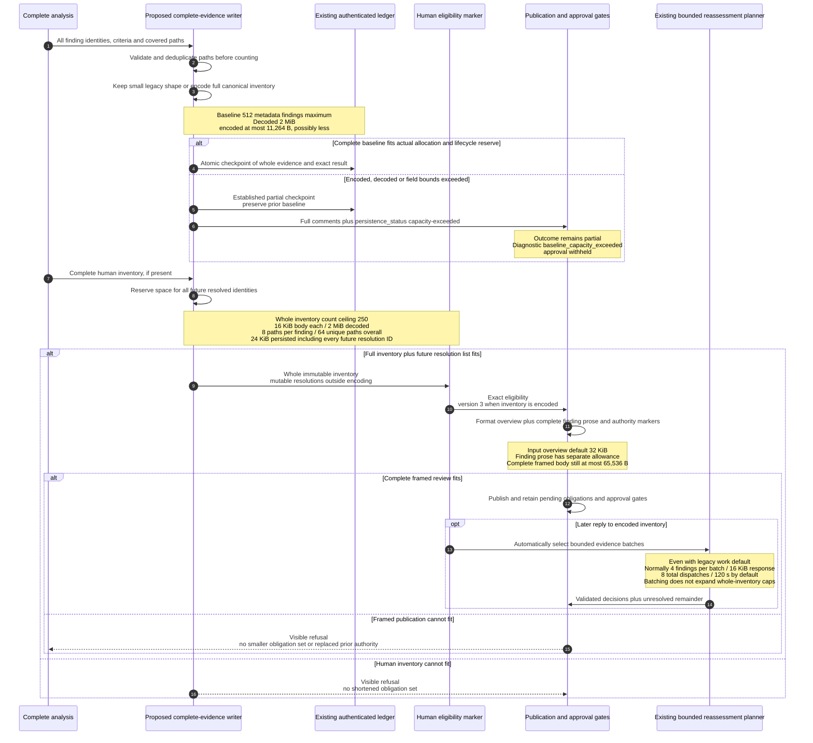

# Unmerged persistence proposal: PR #236 snapshot

This is a separate review snapshot of an **unmerged proposal**, not the current
runtime reference. For shipped behavior at the inspected main revision, use
[review pipelines](review-pipelines.md). No ADR 0072 file is added to this tree
by the documentation PR; the ADR link below targets the proposal commit.
This section is separately reconciled against draft
[PR #236](https://github.com/malsabbagh/review-sensei/pull/236), inspected at
[`9fb5ad6bf74c8cd169b730df4bd5232f59ef2d7d`](https://github.com/malsabbagh/review-sensei/tree/9fb5ad6bf74c8cd169b730df4bd5232f59ef2d7d).
It describes that implementation proposal, **not a merged, released or deployed
feature**. Its [decision record][proposed-adr] remains Proposed.

The inspected PR #236 head was `9fb5ad6bf74c8cd169b730df4bd5232f59ef2d7d`; all
14 source paths were verified at that commit. These are immutable commit URLs,
not moving branch URLs. They remain usable only while GitHub retains reachable
content for that inspected commit. A rebase, deletion or retention change can
make an old snapshot unavailable. Recheck reachability and the reviewed head
before publishing or refreshing this snapshot; report unavailable evidence
instead of silently substituting another revision or claiming its measurements.

The change keeps the existing authenticated inline ledger and atomic lifecycle.
Small legacy-shaped evidence stays readable in its existing form. Larger
inventories use `zlib-json-v1`: canonical JSON compressed with zlib, base64 data,
exact decoded length and SHA-256. The digest checks content integrity; it does
not replace producer/ledger authentication. Encoding is neither encryption nor
redaction. No external evidence service, split-comment store or new YAML capacity
knob is introduced. ([encoder/decoder][proposed-encoding], [baseline writer][proposed-baseline])

Sources: [proposed baseline writer][proposed-baseline],
[human inventory and resolution reserve][proposed-human],
[capacity checkpoint][proposed-cli], [eligibility versions/propagation][proposed-approval],
[publication formatting and final body admission][proposed-publication].
When the proposed runtime is actually adopted, this diagram replaces the
persistence-specific portion of the main flows and encoded human inventories
automatically select the existing bounded reassessment planner on replies.
Small legacy-shaped inventories retain legacy routing unless unified mode is
selected. Lens invocation behavior remains as described in the
[current pipeline guide](review-pipelines.md#how-lenses-run).
([reply routing][proposed-human-controller])

| Boundary | Current inspected main | PR #236 proposal at inspected head |
| --- | --- | --- |
| Complete baseline findings | 2 persisted findings | Whole runtime metadata inventory, at most 512; normal result still at most 250 comments |
| Baseline byte capacity | 11,264 B maximum, allocation can be lower | Same encoded/allocation ceiling, plus strict 2 MiB decoded bound; compression does not guarantee fit |
| Baseline path counting | 512 occurrences before deduplication | 512 validated unique paths after deduplication; related paths still at most 64 |
| Baseline persisted fields | 256-character path/identity, 128-character defect kind | Canonical paths up to 4,096 UTF-8 bytes; symbol/defect-kind validation at 256 bytes; closed expanded schema/runtime checks |
| History and record growth | 12,288 B history / 20,480 B record, 1,024 B baseline reserve | Unchanged envelopes and reserve; no whole-inventory projection |
| Human inventory | 20 findings; 2 KiB/body; 24 KiB whole JSON inventory | 250 findings; full validated 16 KiB/body; 2 MiB decoded; 24 KiB persisted envelope **including all future resolution identities** |
| Human resolutions | Included in existing bounded JSON | Mutable resolved list outside immutable compressed inventory; every subset preflighted against all-resolved capacity |
| Human evidence paths | At most 8/finding, 64 unique/inventory | Unchanged whole-inventory restriction; smaller provider batches do not enlarge it |
| Reassessment per request | At most 20 decisions; unified normally packs 4 | Same per-request caps; trusted multi-batch aggregate can retain whole inventory |
| Rich-inventory reply routing | Whole inventory limited to 20; unified mode explicitly selected | Encoded inventories automatically enter bounded multi-batch reassessment even with the legacy default; the direct legacy request still refuses more than 20 pending findings |
| Latest human eligibility | Versions 1/2 | Versions 1/2 readable; encoded inventory requires version `3` |
| Publication text allowance | Formatted summary, including body-placed findings, charged to input-summary limit (default 32 KiB); final body at most 65,536 B | Finding prose charged separately from input overview; complete framed review still at most 65,536 B |
| Baseline capacity status | `partial` with `coverage-partial` | `partial` remains fail-closed, adds `persistence_status: capacity-exceeded` and diagnostic `baseline_capacity_exceeded`; analysis manifest is preserved |

Sources: [baseline bounds/shape][proposed-baseline], [human bounds and request guard][proposed-human],
[status construction][proposed-cli], [eligibility facts][proposed-approval].
No capacity status clears a human-adjudication obligation. The persistence cause
is included in the exact result digest and retained across delayed finalization
and broader-discovery eligibility union. CLI/review/check presentation names
complete analysis, unavailable baseline persistence and withheld approval rather
than claiming incomplete analysis. Ordinary incomplete-analysis results retain
their prior semantics. ([result contract][proposed-models], [presentation][proposed-presentation], [check mapping][proposed-checks])

Readers bound encoded bytes before decoding, bound decompression to the claimed
length plus one, require exact length/digest and terminated streams without
trailing data, reject noncanonical/duplicate-key JSON, then validate the expanded
schema/runtime fields. A large high-entropy inventory can still exceed encoded
capacity; oversized human markers or formatted review bodies still refuse
publication. Result limits, provider budgets, complete-patch requirements,
transport scans, current source/head fences and approval gates remain independent.
([strict decoder][proposed-encoding], [writer checks][proposed-baseline], [human marker checks][proposed-human], [publication][proposed-publication])

The proposal removes the current three-finding persistence cliff and an
additional publication bottleneck. The publisher now allows the validated
input-summary allowance plus admitted finding-body bytes, capped at 65,536
bytes, for its formatted overview. The original input summary, per-finding
prose and total-result limits still apply. The complete review body, including
eligibility, finding-identity and discussion markers, must separately fit
65,536 bytes before publication. A 41,425-byte formatted fifty-finding review
can therefore publish as a 58,449-byte framed body; it is no longer incorrectly
charged entirely to the 32,768-byte input-summary allowance.
([publication admission][proposed-publication], [qualification decision][proposed-adr])

The following measurements use the final proposal's varied synthetic fixtures:
distinct failure narratives, symbols, paths and request/receipt digests, with
about 555 prose bytes per finding. Above 32 findings they reuse those 32 paths.
These are **reproducible fixtures, not production-frequency estimates or a
capacity guarantee**. Baselines retain identities and criteria, not prose.

| Findings | Baseline encoded bytes | Human envelope needed with every finding resolved | Complete framed human review |
| --- | ---: | ---: | --- |
| 12 | 2,354 | 9,123 | 22,903 B; published |
| 21 | 3,658 | 7,297 | 26,998 B; published |
| 50 | 7,643 | 15,132 | 58,449 B; published |
| 100 | 14,391; refused | 28,714; refused | No authority published |
| 250 | 34,431; refused | 68,841; refused | No authority published |

Twelve human findings retain plain legacy JSON; larger cases use compression,
which explains the decrease at 21 findings. The baseline fixture first exceeds
the 11,264-byte ceiling at 77 findings. With four maximal dispositions and four
maximal retained continuation attestations, the remaining allowance is 10,897
bytes and the first refusal is at 75. Fifty findings plus retained state, a
publication transaction and three full progress entries occupy a valid
16,765-byte record, below 20,480 bytes. These thresholds apply to these fixtures;
longer distinct fields or different retained state can fit fewer findings.
([varied capacity/publication fixtures][proposed-varied-capacity-tests],
[lifecycle/restart fixtures][proposed-capacity-tests], [measured qualification][proposed-adr])

Persistence and publication still need separate checks. Fifty findings with
about 1,110 prose bytes each fit the human envelope at 22,320 bytes including
all resolutions, but their complete framed review exceeds the GitHub body
limit and is refused without replacing prior authority. Fifty findings with
about 1,665 prose bytes each exceed the human envelope itself. A separate
65-unique-path case fails the whole-inventory path restriction before any
remote mutation. Smaller provider batches do not change these limits.
([refusal and authority-preservation tests][proposed-varied-capacity-tests], [qualification][proposed-adr])

The triggering public PR #231 workload provides twelve published explanations
and paths, plus its exact two-obligation human eligibility. Its discarded
original baseline metadata is unavailable. A reconstruction using those
explanations with replacement symbol/evidence identities and fixture cache
metadata needs 2,162 encoded baseline bytes; the exact published human inventory
grows from 2,055 to 2,188 bytes when both obligations are resolved. This supports
useful capacity for the triggering workload without claiming a byte-for-byte
replay of the missing baseline. ([reconstruction and limitation][proposed-adr])

The unchanged single-record bounds remain material for larger normal review
results. The design improves capacity for modest inventories, but does **not**
make every otherwise-valid 250-comment review durably reusable or publishable.
Inspect the explicit capacity outcome and remaining human obligations instead
of treating compression or a higher analysis target as a promise of complete
persistence or approval.

Deploy compatible ledger readers, reply readers and delayed approval finalizers
**before enabling these writers**. Existing valid small records need no forced
reset. Older readers cannot safely consume richer encoded evidence/version 3;
rollback requires restoring compatible readers, not deleting obligations or
falling back to an earlier clean marker. The implementation PR itself does not
merge, release, deploy, move a channel or rerun an affected hosted review.
([rollout decision][proposed-adr], [reader-compatibility gate][proposed-reader-check])

For existing experimental unified-work deployment constraints, see
[shared review work](shared-review-work.md). For the current-main count/reserve
rationale, see [ADR 0070](adr/0070-bounded-checkpoint-overflow.md) and
[ADR 0053](adr/0053-bounded-durable-convergence-history.md).

[proposed-adr]: https://github.com/malsabbagh/review-sensei/blob/9fb5ad6bf74c8cd169b730df4bd5232f59ef2d7d/docs/adr/0072-lossless-inline-review-evidence.md
[proposed-encoding]: https://github.com/malsabbagh/review-sensei/blob/9fb5ad6bf74c8cd169b730df4bd5232f59ef2d7d/src/review_sensei/bounded_evidence.py
[proposed-baseline]: https://github.com/malsabbagh/review-sensei/blob/9fb5ad6bf74c8cd169b730df4bd5232f59ef2d7d/src/review_sensei/baseline.py
[proposed-human]: https://github.com/malsabbagh/review-sensei/blob/9fb5ad6bf74c8cd169b730df4bd5232f59ef2d7d/src/review_sensei/human_assessment.py
[proposed-cli]: https://github.com/malsabbagh/review-sensei/blob/9fb5ad6bf74c8cd169b730df4bd5232f59ef2d7d/src/review_sensei/cli.py
[proposed-approval]: https://github.com/malsabbagh/review-sensei/blob/9fb5ad6bf74c8cd169b730df4bd5232f59ef2d7d/src/review_sensei/hosting/github/approval.py
[proposed-models]: https://github.com/malsabbagh/review-sensei/blob/9fb5ad6bf74c8cd169b730df4bd5232f59ef2d7d/src/review_sensei/models.py
[proposed-presentation]: https://github.com/malsabbagh/review-sensei/blob/9fb5ad6bf74c8cd169b730df4bd5232f59ef2d7d/src/review_sensei/presentation.py
[proposed-checks]: https://github.com/malsabbagh/review-sensei/blob/9fb5ad6bf74c8cd169b730df4bd5232f59ef2d7d/src/review_sensei/hosting/github/checks.py
[proposed-publication]: https://github.com/malsabbagh/review-sensei/blob/9fb5ad6bf74c8cd169b730df4bd5232f59ef2d7d/src/review_sensei/hosting/github/publication.py
[proposed-reader-check]: https://github.com/malsabbagh/review-sensei/blob/9fb5ad6bf74c8cd169b730df4bd5232f59ef2d7d/scripts/check_review_reader_compatibility.py
[proposed-human-controller]: https://github.com/malsabbagh/review-sensei/blob/9fb5ad6bf74c8cd169b730df4bd5232f59ef2d7d/src/review_sensei/hosting/github/human_assessment.py
[proposed-capacity-tests]: https://github.com/malsabbagh/review-sensei/blob/9fb5ad6bf74c8cd169b730df4bd5232f59ef2d7d/tests/test_complete_evidence.py
[proposed-varied-capacity-tests]: https://github.com/malsabbagh/review-sensei/blob/9fb5ad6bf74c8cd169b730df4bd5232f59ef2d7d/tests/test_evidence_capacity.py
